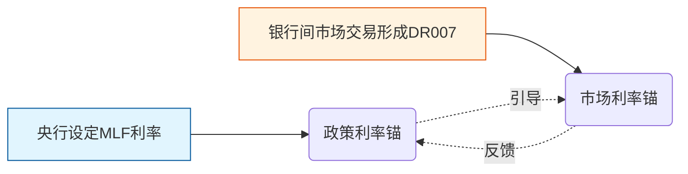

# 《01债券基金》

债券基金就是大家凑钱，请专业经理去买「借条」。

简单来说：
1. **买的是什么？** 国债、企业债等「欠条」，定期还利息、到期还本金。
2. **怎么赚钱？** 主要靠吃利息，其次靠低买高卖赚差价。
3. **有什么特点？** 比股票基金稳，风险小，但收益通常也低一些，适合不想大起大落、追求稳健的人。

## 第一章：重新认识债券基金——它不是「稳赚理财」

很多人第一次接触债基会以为：「股票风险高，债券基金安全，所以债基不会亏。」这是错的。债基不是银行存款，也不是货币基金，而是**通过基金经理管理债券资产，赚取票息和价格波动收益的产品**。

> 债基可以赚钱，也可以亏钱。

### 1. 债基的钱从哪来？

$$
债基收益 = 票息收益 + 资本利得 + 基金经理操作收益 - 信用风险损失 - 费用
$$

### ① 票息收益：债券天然产生的利息

比如买入一张 10 年国债，票面利率 2.5%，持有期间每年拿约 2.5% 利息。这是最基础的收益。

### ② 资本利得：债基赚钱的大头

债券价格和市场利率**呈反向关系**：

```
市场利率下降
→ 新发债券收益率下降
→ 旧债券更值钱
→ 债券价格上涨
→ 债基净值上涨
```

举例：你手里有张 5 年期、收益率 3% 的债；后来市场利率降到 2%，新债只能给 2%，你那张 3% 的旧债变稀缺，别人愿意高价买，债基净值就涨了。

### ③ 基金经理能力

经理可以通过调整期限、信用等级、杠杆、利率周期判断来挣超额收益。

### ④ 信用风险

债券不全是安全的。企业债如果经营失败，可能利息延期甚至本金受损。所以**债券基金 ≠ 国债基金**。

## 第二章：债券基金分类——先搞清楚买的是什么

### 一、货币基金（如余额宝）

投银行存款、同业存单、短期债券。

| 维度 | 情况 |
|---|---|
| 风险 | 极低 |
| 收益 | 约 1%–2% |
| 波动 | 几乎无 |

偏现金管理工具，不是严格意义上的债基。

### 二、短债基金

久期通常 < 1 年，波动很小，收益约 2%–3%，可替代银行理财，风险低。

### 三、中短债基金（最推荐普通投资者关注）

久期 1–3 年，收益约 2.5%–4%，风险低，适合长期闲钱。

### 四、中长期纯债基金

传统意义「债基」，投国债、政金债、企业信用债，收益弹性更高（约 3%–5%，看周期），风险中等，可能出现单季度亏损。

### 五、一级债基

买债券 + 参与新股申购，现在比较少。

### 六、二级债基

已经不是纯债：

```
债券 80%–90%
股票 10%–20%
```

收益可能更高，但股市大跌时也会明显回撤。

### 七、可转债基金

风险最高。可转债 = 债券 + 股票期权，牛市涨得多，熊市跌得狠。

### 小白选择建议

- **保守理财**：短债基金
- **稳健增值**：中短债基金
- **赚债券周期收益**：中长期纯债
- **新手不建议**：二级债基、可转债基金（除非你扛得住股票风险）

## 第三章：债市核心——利率周期

债基上涨靠的不是「央行降息」本身，而是**市场利率下降的预期**。

### 1. 为什么降息利好债券？

市场利率 3% 时你买了张 3% 的债；后来央行降息到 2%，新债只给 2%，你手上 3% 的旧债更值钱，价格就涨。

### 2. 为什么「降息后买债」可能晚了？

金融市场交易预期。市场预测未来降息 → 资金提前买债 → 等真降息时债券已经涨过一轮。

正确逻辑是：看到「经济走弱 + 宽松预期增强」提前布局，而不是等降息落地再追。

## 第四章：理解央行工具
这两个词是央行最常用的大招，但调的东西完全不同
### 一、降准

降低存款准备金率，商业银行吸收存款后必须交一部分给央行当“押金”。降准就是允许银行**少交点押金**，释放银行资金、增加流动性。市场资金变充裕，通常利好债基 📈。但降准≠一定推高债券，因为预期常被提前交易。

### 二、降息

降低政策利率（如MLF、 7 天逆回购利率），银行向央行借钱的“批发价”打折了。银行借钱成本降低，进而降低给老百姓的贷款利息。降低资金价格，通常更直接影响债市。市场整体利率下行，债券价格上涨，**绝对利好债基** 📈。

## 第五章：债基投资三个关键指标

### 指标 1：10 年国债收益率（债市温度计）

```
10 年国债收益率下降
→ 长期债券价格上涨
→ 长债基金上涨
```

### 指标 2：DR007（存款类金融机构7天期质押式回购利率）：市场的“真实成交价”
-   **是什么**：银行之间互相借7天钱的真实利率。注意，只有“存款类金融机构”（主要是银行）参与，排除了非银机构的干扰，最能反映银行体系真实的资金松紧程度。
-   **角色定位**：**市场利率锚**。它是债市每天波动的“心跳图”。
-   **怎么看**：
    -   DR007 < MLF利率 → 市场资金比央行给的还便宜，说明钱很宽松 → **利好债市**。
    -   DR007 > MLF利率 → 市场资金比央行给的还贵，说明钱很紧张 → **利空债市**。
    -   DR007持续走高 → 即使央行没表态，也说明市场自发在收紧，需警惕债基回调。
-   **小白记忆**：DR007是银行间“黑市价”，它比MLF更敏感、更实时。

### 指标 3：MLF（中期借贷便利）：央行的“官方指导价”
-   **是什么**：央行借钱给商业银行的利率，期限通常为1年。
-   **角色定位**：**政策利率锚**。它是整个市场利率体系的“天花板”和“风向标”。
-   **怎么看**：
    -   MLF利率下调 → 央行明确释放宽松信号，引导市场利率下行 → **强利好债市**。
    -   MLF利率不变/上调 → 央行态度中性或偏紧 → 债市缺乏进一步上涨动力。
-   **小白记忆**：MLF是央行定的“批发价”，它动了，所有利率都会跟着动。

### 3. MLF 与 DR007 的关系图谱


> 💡 **实操口诀**：**MLF看方向，DR007看情绪**。MLF决定债市中长期趋势，DR007决定短期波动。两者背离时（如MLF没降但DR007持续走低），往往是债牛启动的前兆。

## 第六章：工具对比篇——场外债基 vs 国债ETF（新增核心）

知道了宏观和指标，还得选对工具。很多人混淆“场外纯债基金”和“场内国债ETF”，其实它们是完全不同的物种。

### 1. 本质区别速查表

| 对比维度 | 场外纯债基金 | 场内国债ETF |
| :--- | :--- | :--- |
| **交易场所** | 支付宝/天天基金/银行APP（申赎制） | 股票账户（买卖制，像炒股一样） |
| **定价机制** | 每日收盘后按净值成交（一天一个价） | 盘中实时竞价成交（价格每秒都在变） |
| **底层资产** | 一篮子债券（国债+金融债+企业债等混合） | 跟踪特定国债指数（如5年/10年/30年国债） |
| **费率** | 管理费+托管费+申赎费（综合约0.4%-0.6%） | 仅佣金（万0.5-万2，免印花税） |
| **流动性** | T+1确认，赎回通常T+2到账 | T+0回转交易，当日买入当日可卖 |
| **适合人群** | 追求稳健、不想盯盘、长期持有的普通投资者 | 有股票账户、想波段操作、对冲股市风险的进阶玩家 |

### 2. 核心差异深度拆解

#### ① 收益来源不同
-   **场外债基**：赚的是“票息+资本利得+杠杆收益”。基金经理可以加杠杆（借钱买债）、做信用下沉（买企业债增厚收益），所以长期收益通常高于纯国债ETF。
-   **国债ETF**：赚的是“国债价格波动+票息”。完全被动跟踪指数，不加杠杆、不做信用下沉，收益纯粹取决于国债收益率走势。

#### ② 风险特征不同
-   **场外债基**：风险来自“利率波动+信用违约+基金经理操作失误”。可能踩雷，也可能因经理能力强而跑赢指数。
-   **国债ETF**：风险几乎只有“利率波动”。因为底层全是国债，**零信用风险**，但也意味着没有超额收益的可能。

#### ③ 使用场景不同
-   **场外债基**：当作“理财替代”，长期持有攒收益，不择时。
-   **国债ETF**：当作“交易工具”，用于：
    -   股市大跌时避险（股债跷跷板效应）；
    -   预判利率下行时快速抄底长债；
    -   做T+0日内波段套利。

> 💡 **选择建议**：如果只想稳稳拿个年化3%-4%，选**场外纯债基金**；如果你有股票账户，想自己判断利率走势、灵活进出，选**国债ETF**。两者不冲突，甚至可以搭配使用。

---

## 第七章：怎么判断现在适不适合买债

别问「债基还能不能买」，改问「当前债券收益率处于什么位置」。

1. **看利率位置**：10 年国债在历史高位 → 债券便宜可买；在低位 → 已贵，未来空间小。
2. **看经济周期**：经济下行 → 利率易降 → 利好债；复苏期 → 利率易升 → 债有压力。
3. **看股债性价比**：股票极度低迷，资金避险进债；股票疯涨，资金流出债。

---


## 第八章：如何挑选优秀的债券基金

如果你选择了场外债基，请用以下四步法筛选：

### 第一步：选公司——看“大厂”和“固收实力”
-   **优先选**：头部公募（如易方达、招商、华夏、广发等）。信评体系完善，能实现“零踩雷”。
-   **避开**：规模极小、管理混乱的迷你基金公司。

### 第二步：选经理——看“从业年限”和“历史曲线”
-   **标准**：任职年限 > 5年（最好8年以上），经历过完整牛熊周期。
-   **看曲线**：优秀债基净值曲线应**平滑向上**，而非过山车。

### 第三步：看规模——寻找“舒适区”
-   **最佳区间**：**5–200 亿**。

### 第四步：查持仓——看“久期”与“信用资质”
-   **看评级**：前五大重仓债若是国债、AAA级金融债，信用风险极低；若大量低评级城投/企业债，需警惕。
-   **看久期**：久期越短受利率波动影响越小；久期越长收益弹性大但风险也高。

### 🔧 推荐工具
-   **天天基金网 / 支付宝理财**：查规模、持有人结构、回撤、卡玛比率。
-   **基金季报/年报**：查重仓债名称、评级、久期、杠杆率。
-   **中国货币网 / Wind**：查DR007、MLF利率走势。

## 第九章：如何阅读一只债基的季报

只看净值曲线是不够的，真正懂行的人会翻季报。

### 一、投资组合报告
关注债券资产占比。纯债基金的债券仓位通常 **>90%**，如果权益或其他资产占比明显上升，要了解背后的策略变化。

### 二、前五大重仓债券
重点看评级与行业分布，确认是否集中在高风险板块。

### 三、久期变化
如果久期从 3 年突然拉到 8 年，说明基金经理在押注降息，组合波动会明显加大。

### 四、杠杆变化
在市场高位、估值偏贵时，如果基金仍大幅加杠杆，需要提高警惕。

## 第十章：风险

很多人以为债基只有利率风险，实际上至少有三类：

1. **利率风险**：央行收紧、市场利率上行，长债价格下跌。
2. **信用风险**：企业还不起钱（如地产债违约），持有相关债券的基金净值受损。
3. **流动性风险**：大量投资者同时赎回，经理被迫低价卖债，进一步压低净值。

## 真实案例复盘——暴涨与暴跌的教训

### 📈 暴涨案例：2024年华泰保兴安悦（极致利率放大器）
-   **操作**：重仓30年期超长期国债，拉长久期。
-   **结果**：利率下行周期中，单季度收益达8.46%，成为网红产品。
-   **启示**：宽松周期拉长债久期确实能赚超额收益。

### 📉 暴跌案例：2025年华泰保兴安悦（成也久期败也久期）
-   **背景**：市场风向突变，利率上行。
-   **结果**：高久期变成“放大器”，一个多月跌幅超3.5%，抹平前期涨幅。
-   **启示**：债基绝非保本理财！利率上行时，高久期债基杀伤力极大。

### 💥 踩雷案例：2025年末华宸未来稳健添利A（信用风险爆发）
-   **背景**：万科债展期担忧引发地产债暴跌。
-   **结果**：四个交易日净值暴跌超7%，散户恐慌赎回导致“下跌-赎回-再下跌”恶性循环。
-   **启示**：永远不要忽视信用风险！一定要看基金经理的信评能力和持仓评级。

### 中国债市的未来——别再幻想过去的高收益

过去十几年债基好做，一个重要背景是**长期降息周期**：10 年国债收益率从 4% 以上一路降到 2% 附近，资本利得丰厚。

但站在当前位置，长期利率已经处于偏低区间，未来债基的收益来源会更偏向：
> **票息收益为主，资本利得为辅。**

投资逻辑也应从「买长债博暴涨」转向「控制回撤、获取稳定收益」。


## 第十一章：债基投资的三个纪律

1. **不追高**：债基连续大涨，往往已反映宽松预期，追进去容易买在阶段性高点。
2. **不恐慌**：中长期纯债短期回撤 1%–2% 可能是正常波动，频繁止损反而容易错过后续修复。
3. **不短炒**：债基的核心收益来自票息，频繁买卖不仅损耗手续费，还很难赚到完整收益。


## 最后

> 债券基金不是让你暴富的工具，而是让你的财富在等待机会时，不被通胀慢慢侵蚀，同时降低整体资产波动的工具。

真正成熟的投资者，不是在牛市里赚得最多，而是在任何市场环境下，都能保持资金稳定，并且拥有等待下一次机会的能力。

