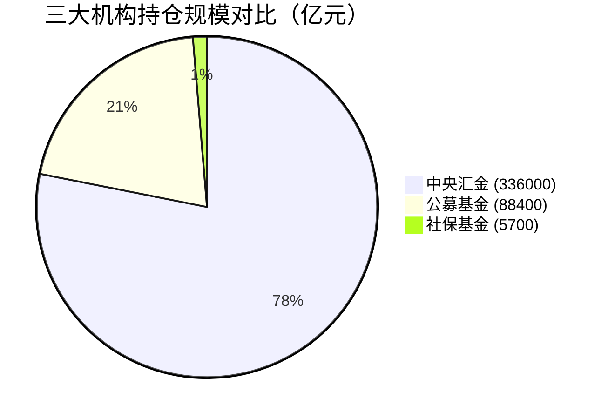
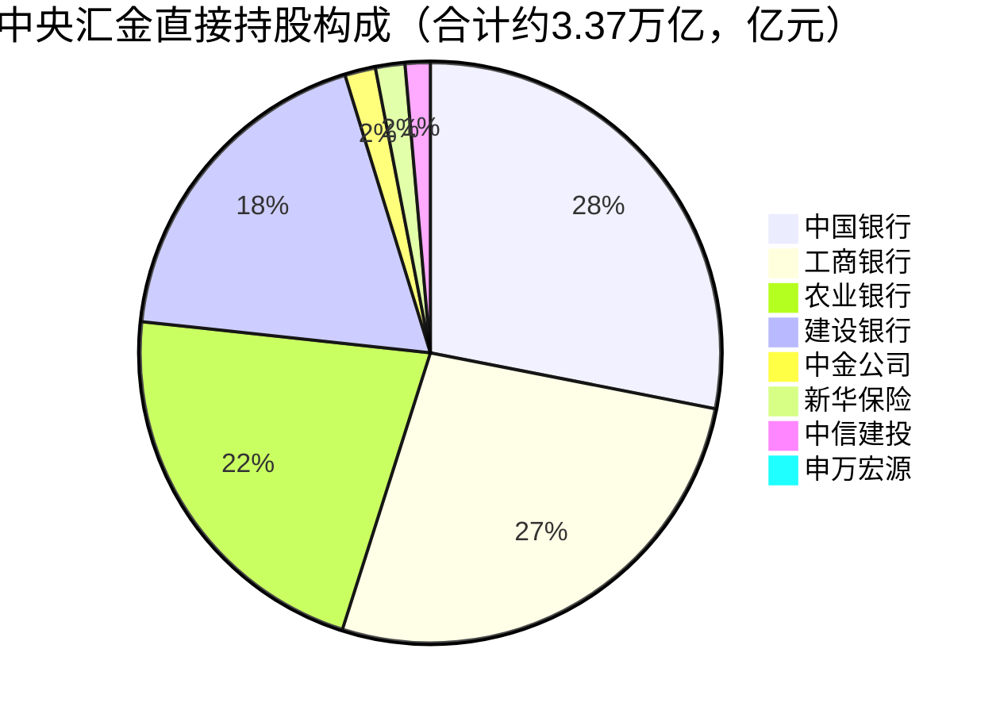
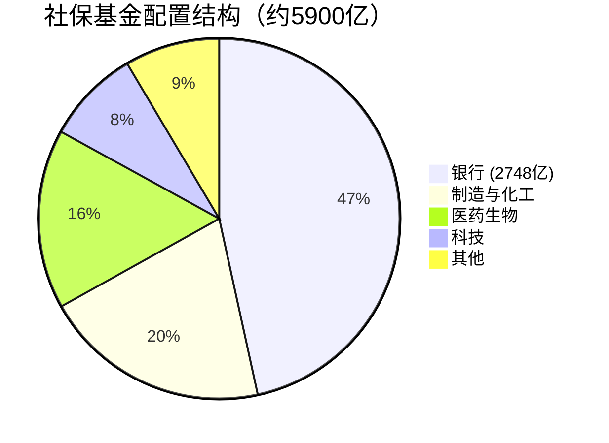
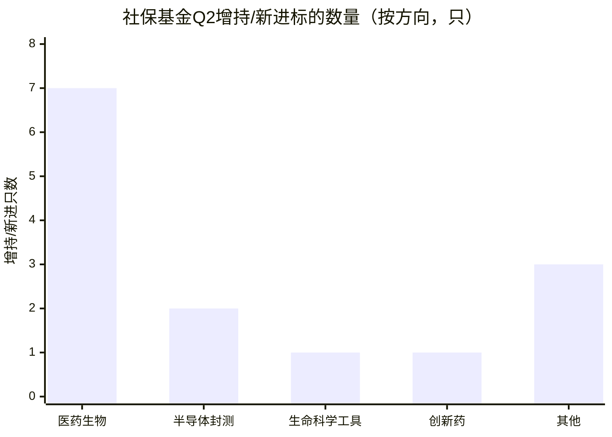
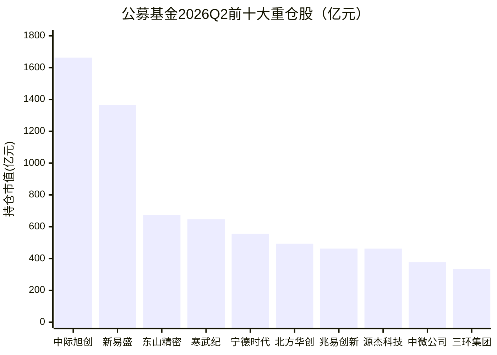
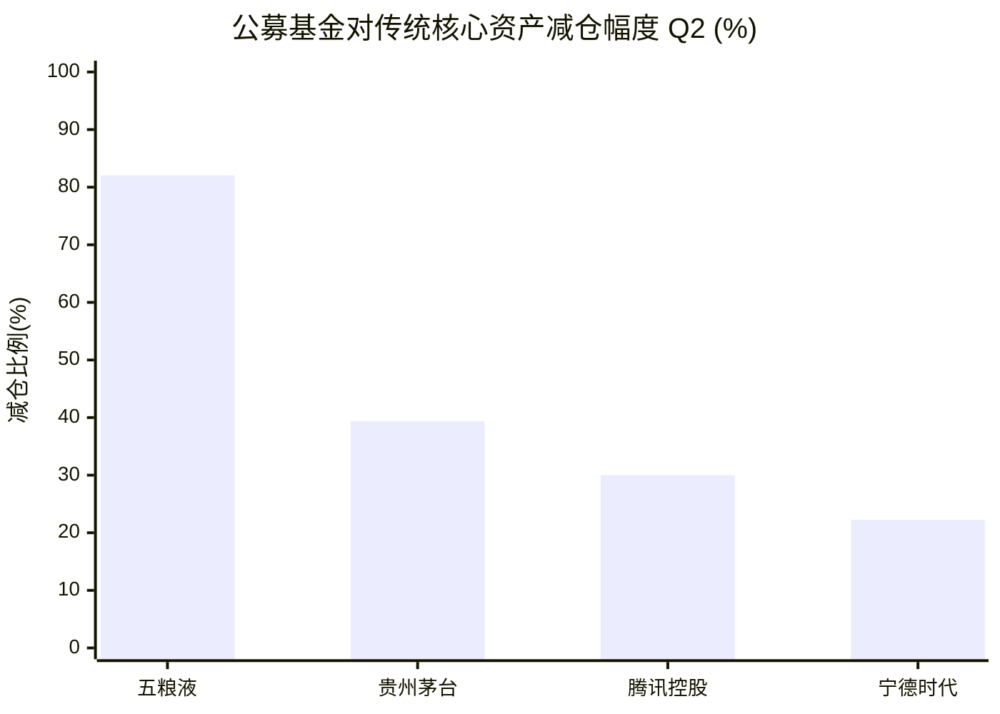

# 三大机构A股持仓深度对比：汇金、社保、公募的三足鼎立格局

最近我拿到了一份很有意思的报告——《三大机构A股持仓对比与调仓趋势深度研究报告》，报告日期是2026年8月2日，数据截止到2026年一季报和二季报。这份报告把A股最重要的三类机构投资者的持仓全部拆开来看，对比他们买了什么、卖了什么、各自在想什么。结论非常鲜明：三者的定位完全不同，形成了**汇金守金融、社保拓制造与医药、公募攻科技**的三足鼎立格局。

简单说就是：国家队死拿着银行不放，社保在悄悄买制造业和医药，公募基金则发了疯一样往AI冲。

---

## 一、先看总览：三家机构的体量和风格

| 机构 | 持仓规模 | 持股数量 | 核心定位 |
|------|---------|---------|---------|
| 中央汇金 | 约3.36~3.37万亿元 | 直接持股仅8家公司 | 金融压舱石 |
| 社保基金 | 约5500~5900亿元 | 现身611~707家公司前十大股东 | 长线价值猎手 |
| 公募基金 | 股票资产约8.84万亿元，主动权益前十大重仓超7000亿 | 高度集中在AI算力链 | 趋势交易主力 |

这三家的风格完全不同。汇金3.37万亿只拿八只股票，社保5900亿分散在600多家公司，公募8.84万亿却高度集中在AI算力链。接下来我们一家一家拆开看。

---

## 二、中央汇金：八只铁仓不动，ETF做逆周期调节

### 直接持股：极度集中的八只股票

中央汇金在A股的直接持股极度集中，只现身八家公司的前十大股东：

**四大行：**
- 工商银行：持有约1240亿股，占流通股34.79%，市值约9834亿
- 中国银行：持有约1885亿股，占流通股64%以上，市值约1.03万亿（这是汇金持股市值最高的单只股票）
- 农业银行、建设银行同样重仓

**四家非银金融：**
- 中金公司（627亿）、新华保险（601亿）、中信建投（512亿）、申万宏源（235亿）

八只合计约3.37万亿元。而且这八只在2026年Q1和Q2**全部不变，不增不减不退出，连续两个季度零调仓**。这在全球机构投资者里极为罕见。

汇金的定位是**战略性控股**，不是做投资回报的，是确保国家对金融体系的控制力。他不追涨不杀跌，市场涨跌跟他没关系，他就坐在那里当压舱石。

### ETF操作：逆周期调节的真正工具

汇金在个股上不动，但在ETF上动了。2026年上半年，汇金相关主体**净卖出了约1万亿份宽基ETF**——这是一个非常罕见的量级。

这个操作发生在A股从低位回升到4200点的过程中。什么意思？市场低迷的时候，汇金买入ETF托底；市场回暖了，汇金就卖出一部分释放流动性。这就是**逆周期调节**：在别人恐慌时买入，在别人贪婪时卖出。

汇金的全资子公司汇金资管持股更分散一些，覆盖了中国平安、中国人寿、贵州茅台、五粮液等消费金融龙头，但单支持仓比例极低——茅台和五粮液都不到0.01%的流通股，基本可以忽略不计。

所以汇金的故事很简单：**八只铁仓不动，通过ETF做逆周期调节。他不是交易者，是稳定器。**

---

## 三、社保基金：银行打底，制造与医药渐进渗透

### 整体配置：三层结构

社保基金2026年Q1现身611~707家A股公司的前十大流通股东，合计持仓市值约5500~5900亿元。社保的配置结构是三层：

1. **银行打底**：合计持仓市值2748.35亿元，占总持仓的一半以上。第一大重仓股是农业银行（1575.90亿元），工商银行（942.14亿元）紧随其后。
2. **制造与化工为翼**：包括化工龙头万华化学、机械龙头三一重工、玻纤龙头中国巨石、新能源车龙头比亚迪等。
3. **医药与科技渐进渗透**：这是Q2的重点加仓方向。

### Q1的布局：逆向买入行业龙头

社保不只是守银行，它做了一系列布局：

- **比亚迪**：持有4200万股，市值44.20亿，增持298万股
- **万华化学**：持有5410万股，市值42.98亿，**大幅增持2870万股**
- **三一重工**：市值40.38亿，增持1609万股
- **中国巨石**：持有1.14亿股，市值31.10亿，增持超过4200万股

看出来了吗？社保买的都是各自行业的龙头——化工龙头万华、机械龙头三一、玻纤龙头中国巨石、新能源车龙头比亚迪，而且都是在行业周期底部增持。这就是典型的**逆向布局**。

社保在Q1还有两个重要新进：
- **汇川技术**：新进买入3060万股，市值20.50亿。汇川是自动化设备龙头，这个新进说明社保看好高端制造复苏。
- **迈瑞医疗**：新进买入700万股，市值11.53亿。迈瑞是医疗器械龙头，社保选择了逢低布局。

另外，养老基金在Q1也有新进，包括深南电路、鼎通科技、海容冷链等，增持了甘李药业、鱼跃医疗、蓝晓科技。养老基金比社保整体更偏成长、更偏医药。

### Q2的调仓：明确加码医药成长赛道

到了Q2，社保的调仓方向更明确了。Q2社保增持或新进11支、减持四支，新进的标的集中在三个方向：

**半导体封测：**
- 汇成股份：新进1366万股，半导体封装测试

**生命科学工具：**
- 华大智造：新进416万股，基因测序国产替代龙头

**创新药与医疗器械：**
- 百仁医疗：新进75万股，植入介入医疗器械
- 信立泰（养老基金新进）：738万股，创新药
- 普洛药业（养老基金新进）：2346万股，主营原料药及CDMO

14只增持和新进的股票里有七只是医药生物。这说明社保在Q2明确加码医药成长赛道。它的选股标准也很清晰：**明确技术壁垒高、持续盈利、估值处于历史偏低分位的细分赛道龙头。**

社保不追逐热门标的，它在大家不看好的时候慢慢买入有壁垒的公司。

---

## 四、公募基金：All in AI，历史性的结构性切换

这是变化最剧烈的部分。2026年二季度，公募基金前十大重仓股发生了**2019年以来最剧烈的结构性更替**——AI算力链全面霸榜，消费、医药、港股互联网集体退出前十。

### 前十大重仓股：六只是新进

| 排名 | 股票 | 持仓市值 | 所属领域 | 变化 |
|------|------|---------|---------|------|
| 1 | 中际旭创 | 1662.53亿 | 光模块龙头 | 维持 |
| 2 | 新易盛 | 1366.21亿 | 光模块 | 增持46.86% |
| 3 | 东山精密 | 674.06亿 | PCB | 维持 |
| 4 | 寒武纪 | 647.14亿 | AI芯片 | **新进前十** |
| 5 | 宁德时代 | 555.19亿 | 电池 | 被减持22.26% |
| 6 | 北方华创 | 492.87亿 | 半导体设备 | **新进前十** |
| 7 | 兆易创新 | 462.52亿 | 存储芯片 | **新进前十** |
| 8 | 源杰科技 | 462.24亿 | 光芯片 | **新进前十** |
| 9 | 中微公司 | 377.17亿 | 刻蚀设备 | **新进前十** |
| 10 | 三环集团 | 334.79亿 | 电子陶瓷 | **新进前十** |

前十名里有六只是新进。两只光模块龙头（中际旭创+新易盛）合计持仓超3000亿。这不是调仓，这是**换了一拨人**——AI霸榜。

### 传统核心资产的集体退场

```mermaid
xychart-beta
    title "公募基金一级行业配置占比变化 Q1→Q2 (%)"
    x-axis ["电子","通信","电力设备","白酒"]
    y-axis "占比(%)" 0 --> 45
    bar [15, 5, 12, 8]
    bar [40, 15, 6.6, 5.7]
```

- **贵州茅台**：从前十跌到了第30位，持仓市值环比减少476亿，减仓比例达39.39%。持有茅台的基金从1339只降到了982只，四成基金抛弃了茅台。
- **五粮液**：更惨，减仓82.06%。
- **腾讯控股**：减持市值187.37亿，是公募减持规模最大的个股之一。
- **宁德时代**：虽然留在前十，但被减持22.26%。
- **比亚迪**：重仓基金减少224家。

2025年底还占据前十的茅台、药明康德、腾讯和立讯精密，这四支全部退出前十。公募基金从一个季度到下一个季度，把消费、医药、互联网、新能源全卖了，全仓冲进了AI算力链赛道。这个切换速度和幅度，在A股公募历史上极为罕见。

### 行业配置的极化程度

2026年Q2，公募基金一级行业配置中：
- **电子行业**：占比约40%
- **通信行业**：约15%
- **两者合计近60%**

而一个季度前（Q1），电子还只占约15%。一个季度从15%跳到40%，加仓了21.5个百分点，这个迁移速度超出所有人预期。

对应的减仓方向：
- 电力设备：减5.4个百分点
- 白酒：减2.3个百分点

前50大重仓股里，传统行业标的只剩三只：美的集团、紫金矿业、杰瑞科技，而且紫金和美的都被减持了60%的仓位。

公募基金集中在电子和通信两个行业，这不是分散投资，这是**All in AI**。公募基金用脚投票，把核心资产时代画上了句号，正式进入了硬科技时代。

---

## 五、三家对比：三足鼎立，各守其道

把三家放一起对比，差异一目了然：

| 板块 | 汇金 | 社保 | 公募 |
|------|------|------|------|
| 银行 | 绝对控股四大行，3.5万亿 | 第一大行业持仓，2748亿 | 基本不配 |
| 电子/半导体 | 完全没有 | 加速渗透科创板，70支177亿 | 绝对主导，约40% |
| 通信/算力 | 没有 | 极少 | 约15% |
| 医药生物 | 没有 | Q2集中加码（信立泰、普洛药业、百仁医疗等） | 只有药明康德排第18 |
| 基础化工 | 没有 | 重点配置，万华化学43亿 | 不配 |
| 白酒 | 汇金资管微量持有 | 不配 | 大幅减仓（茅台减39.39%，五粮液减82.06%） |

总结成一句话：**汇金的钱在银行，社保的钱在制造和医药，公募的钱在AI算力链。** 三者在银行有交集，但在科技和消费板块完全分化。

### 选股逻辑完全不同

**汇金的逻辑**：战略性控股。不追求投资回报，追求国家对金融体系的控制力。所以八只股票不动、零调仓。它的市场调节通过ETF实现——市场过热时卖ETF释放流动性，市场低迷时买ETF托底。

**社保的逻辑**：高质量实体加安全边际。买有技术壁垒的细分行业龙头，估值在历史低位，符合国家产业政策。比如万华化学是化工全球龙头，汇川技术是自动化龙头，迈瑞医疗是器械龙头。社保在估值低位逆向买入，等三到五年回来收钱。

**公募的逻辑**：景气度驱动。追行业景气度最高的赛道，哪个赛道最火就往哪个冲。Q2 AI算力链最火，公募就把60%的仓位压上去。这不是价值投资，这是趋势交易。

### 调仓节奏形成互补

- **汇金**：极低频。Q1和Q2个股零调仓，只通过ETF做逆周期调节，释放了约1万亿份ETF流动性。
- **社保**：季度级。Q2增持新进11支、减持四支，温和加仓，不急不躁。
- **公募**：高频交易。Q2前十有六只换血、四只退出，一个季度就完成了从消费到AI的全面切换。

三者形成了资金流接力：**长线资金承接，趋势资金进攻。** 汇金退出ETF释放的钱，一部分被社保在底部承接了（制造业和医药），一部分被公募追着AI冲进去了。

---

## 六、对普通投资者的启示

### 值得关注的信号

**第一，社保基金新进或大幅增持的标的具有信号价值。** 它有长线资金背书。社保买万华化学（增持2870万股）、新进汇川技术和迈瑞医疗，这些公司通常具备技术壁垒高、估值低位、业绩增长确定性强的特征。社保的考核周期是三到五年，他买入意味着他认为三到五年内这些公司会涨。跟着社保走，不一定赚最快，但安全性比较高。

**第二，公募基金的持仓极度集中本身就是一个风险信号。** 60%仓位在电子和通信，前十重仓股六只是新进。一旦AI算力链景气度出现边际变化——比如北美资本开支增速放缓、光模块价格竞争加剧——公募重仓股的波动性会因为持仓高度趋同而被显著放大。

**第三，被公募抛售的传统资产不一定是坏公司。** 茅台被减仓39.39%，五粮液被减仓82.06%，但这些公司的基本面没有恶化到这个程度。公募的集体抛售更多是资金流动的结果，不是价值判断。对于价值投资者来说，公募集中抛售的时点，反而可能是逆向布局的机会。

### 必须警惕的风险

**第一，AI算力链的拥挤交易。** 澜起科技Q2股价涨了147.4%，但机构减仓了29.13%。股价上涨推动市值增长，实际上机构在高位获利了结。这说明部分基金经理已经开始在AI高位标的上兑现收益了。

**第二，公募持仓的趋同效应。** 当所有基金都买中际旭创和新易盛的时候，一旦有人开始卖，其他人可能被迫跟着卖——因为不卖的话净值会跌。这种踩踏效应在持仓高度趋同时特别危险。

**第三，传统板块虽然下跌空间有限（公募持仓已降至历史低位），但短期内也缺乏增量资金驱动。** 茅台持有基金从1339只降到982只，这982只里如果还有人想走，茅台还会继续承压。底部不等于马上涨。

---

## 七、对下半年市场的判断

1. **汇金**大概率继续按兵不动。如果A股在4200点上方继续涨，汇金可能继续卖ETF；如果回调，汇金可能重新买入托底。

2. **社保**有望延续Q2方向，在半导体设备和创新药上游继续加仓，科创板持仓从试探进入加仓的上升通道。

3. **公募**面临的核心风险是AI算力链持仓拥挤。如果景气度预期出现边际变化，重仓股波动会放大。部分基金经理已经开始高位兑现了。

4. **消费和新能源**板块进一步下跌空间有限，但短期缺乏增量资金驱动。底部不等于马上涨。

---

最后说几句。这份报告最大的价值不是告诉你买什么，而是让你看到三类"聪明钱"各自在想什么：**汇金想的是市场稳定，社保想的是长线价值投资，公募想的是追逐趋势。**

作为普通投资者，你不需要跟任何一家走，但你需要理解他们的逻辑——因为他们的资金体量太大了，他们的买卖直接影响你手里的股票价格。

- 社保逆向布局的标的，可以作为中长期参考；
- 公募集中冲的方向，需要警惕拥挤；
- 汇金的操作告诉你市场的温度——他在卖ETF的时候，市场可能偏热了。

