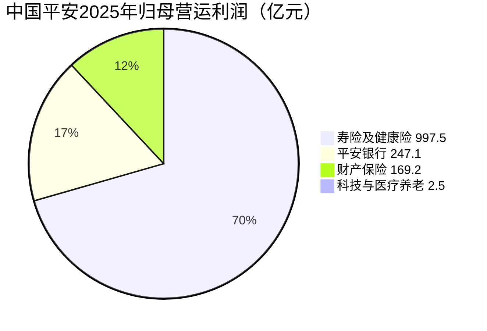

# 深度解析中国平安：保险生意的底层逻辑与估值真相

## 开篇：为什么研究平安？

**借平安把两个绝大多数投资者一头雾水的问题彻底讲清楚**：

1.  **保险这门生意到底是怎么运转的？** 死差、费差、利差、内涵价值、新业务价值这些名词到底是什么意思？
2.  **为什么保险不能用市盈率（PE）估值？** 它真正的估值方法PEV到底怎么用？

这两个问题搞懂了，你看整个保险板块都是降维打击。

### 预防针：平安的巨大反差
中国平安1988年成立于深圳蛇口，从一家13人的小保险公司起家，今天是中国最大的综合金融集团。
-   **规模**：营收超过1万亿，个人客户2.51亿（约每6个中国人就有1个是平安客户）。
-   **版图**：寿险、产险、银行、资管、科技五大板块。
-   **股价反差**：2020年前后股价一度接近百元，现在53块左右，从高点算起接近腰斩，五年了还趴在半山腰。

一家营收过万亿、每年赚一千多亿、分红连续14年增长的公司，股价为什么趴着不动？答案都在保险这门生意的特殊性里。本期内容分为六部分：
1.  中国平安及保险底层逻辑"三差"
2.  平安五大业务板块拆解
3.  保险名词课（翻译黑话）
4.  保险估值课（PE失效与PEV用法）
5.  **利差损攻防战：市场真正在担心什么**（新增，2025-2026年保险股定价的第一变量）
6.  平安完整算账与投资启示

---

## 第一部分：中国平安概况与保险底层逻辑

### 1.1 中国平安成长史
-   **1988年**：深圳蛇口平安保险成立，仅13名员工，做产险起家。
-   **1995年**：进入寿险，奠定保险帝国起点。
-   **2004年/2007年**：分别在香港、A股上市。
-   **2012年**：平安银行与深发展合并，补齐银行板块。
-   **后续**：集齐基金、证券、信托、资管牌照，形成"综合金融"全家桶。

### 1.2 2025年核心数据
-   营收：10,505亿元
-   归母营运利润：1,344亿元
-   归母股东权益：首次突破1万亿
-   保险资金投资组合：6.49万亿
-   个人客户：2.51亿（持有3条及以上产品线客户留存率99%）

### 1.3 保险生意的本质：收钱 + 管钱
保险与普通生意完全不同，它是 **"先收钱后履约"**。
-   **负债端（收钱）**：卖保单收保费，承诺未来赔付。
-   **资产端（管钱）**：把保费拿去投资，赚取收益。

> **关键认知**：对保险公司来说，**保单是负债，不是资产**。保费进账的同时记下一笔未来的赔付债务。这就是为什么用普通公司眼光看保险永远看不明白。

### 1.4 利润来源：三差
| 名词 | 定义 | 备注 |
| :--- | :--- | :--- |
| **死差** | 实际死亡率 < 假设死亡率 | 赔得少，赚差价 |
| **费差** | 实际运营费用 < 假设费用 | 省下的佣金、办公费等 |
| **利差** | 实际投资收益率 > 假设收益率 | **利润最大且波动最大的一块** |

*注：平安6.49万亿投资组合，收益率每变动1个百分点，盈亏即达649亿，约占全年营运利润一半。利差是三差的主角，也是第五部分的主角。*

### 1.5 政策如何改写"三差"（2019-2025）

讲三差不能只讲理论，用两道近几年的监管政策当案例，你马上能懂。

**第一道：报行合一，改的是费差。**

先搞懂这名字。保险公司给银行多少卖保险的佣金，是要报给监管部门备案的。过去是什么光景？**报是一套，给是另一套**：名义上给佣金1%，暗地里返费、补贴、变相塞钱加起来能有3%，费用严重失控——保险公司卖得越多，账上亏得越多。

报行合一就四个字：**说到做到**。备案写多少，实际就给多少，暗钱不许塞。结果全行业平均佣金直接降了约30%：保险公司给渠道的钱少了，实际费用低于精算假设，**费差从亏钱变成赚钱**。这就是平安靠银行网点卖的保单、新单价值同比大增68.5%（2024年前三季度）的直接原因。

代价谁扛了？银行。代销保险的收入被砍掉一大截（平安银行2024年同比-71.8%）——但这是"左手转右手"，集团内部银行少赚的，寿险多赚回来了。

**第二道：预定利率下调，改的是利差。**

预定利率，就是保险公司写进合同、承诺给客户的"保底利息"。你买一份储蓄险，将来能拿回多少钱，就是按这个利率滚出来的——它越低，保险公司未来要付给客户的钱就越少。

它一路往下走：2019年之前最高能承诺4.025%，之后降到3.5%（2019年）、3.0%（2023年）、2.5%（2024年），到2025年9月正式进入2.0%时代。**对客户是利空（收益低了），对保险公司是利好（成本低了）**：新单的刚性成本降一截，新单利润率（NBV率）就抬一截。平安2025年新单利润率28.5%、同比提升5.8个百分点，一半功劳就是政策给的。

一句话总结这两道政策：**一个让保险公司少花钱（费差），一个让保险公司少承诺（利差），都是在帮保险公司把报表变好看。** 但注意——"少承诺"并不等于稳赚，如果投资收益掉得比承诺更快，利差照样是亏的。这就是第五部分的主角：利差损。

---

## 第二部分：平安五大业务板块拆解

五个板块用同一张"体检表"看：**干什么 → 2025年成绩 → 关键指标 → 集团里的角色**。

先看规模占比——哪个板块在真正赚钱？（2025年归母营运利润，亿元）

> **怎么读这张图**：图例里每个板块后面都标了"亿元"数值，百分比是 Mermaid 按四块之和（1,416亿）自动算的。寿险独占约七成，是整个平安的利润核心——这就是为什么说"寿险是灵魂"。资产管理2025年**亏损37.85亿**（连续第二年减亏68%）、其他业务及合并抵销-34.35亿，是负数没法画进饼图；以集团归母营运利润1,344.15亿为分母，寿险占比约**74%**。
>
> **那"投资平台"资管去哪了？** 它的重要性不在它自己的利润表上，而在它管理的**6.49万亿保险资金**给寿险贡献的利差里——这笔投资收益已经算进寿险的利润和 EV 里了（还记得 5.2 的利差吗）。所以资管的价值不是"图里漏了"，而是**藏在寿险那七成里**；它自己作为独立板块的亏损（37.85亿，主要是资管子公司、信托的承压资产减值，地产风险正在出清），是另一笔账。这和"同一笔投资收益不能重复计算"是同一个道理。
>
> 口径说明：饼图用**归母营运利润**（剔除投资波动，平安自己的口径），和第二部分体检表里各板块的"净利润"不是一回事——比如银行体检表里的426亿是归母净利润，营运利润口径是247亿。

### 1. 寿险及健康险（灵魂与核心）
-   **干什么**：卖重疾、年金、分红、终身寿险等长期保单。平安的"灵魂"，利润在卖出时通过精算锁定，但要**长期释放**——前期佣金高往往亏损，后期利润才兑现。
-   **2025年成绩**：新业务价值（NBV）368.97亿（+29.3%），新单利润率28.5%（+5.8pct）；寿险内含价值9,286亿（+11.2%）。
-   **关键指标**：**新业务价值（NBV）**——看寿险成长不看存量，看新单质量。NBV高增一大半是政策红利（预定利率下调+报行合一），见1.5。
-   **集团里的角色**：最大利润与估值弹性所在。

### 2. 产险（稳定器）
-   **干什么**：车险、责任险等一年期短险，保单一年一卖，利润当年见分晓。
-   **2025年成绩**：保费3,431亿（+6.6%）；综合成本率96.8%（<100%即承保盈利），同比优化1.5pct，行业优秀。
-   **关键指标**：**综合成本率**——（赔付+费用）/保费，越低越赚。
-   **集团里的角色**：利润"稳定器"，负责平滑集团业绩的大起大落。

### 3. 平安银行（协同抓手）
-   **干什么**：对公+零售全牌照银行，综合金融交叉销售的枢纽。
-   **2025年成绩**：净利润426亿；不良率1.05%；拨备覆盖率220.88%。
-   **关键指标**：**不良率、拨备覆盖率**——银行看资产质量，不看营收。
-   **集团里的角色**：交叉销售关键——持有3类以上产品的客户留存率达99%。代价：报行合一让代销保险收入-71.8%，但集团内部"左手转右手"，换来寿险银保NBV翻倍。

### 4. 资管（投资平台）
-   **干什么**：管钱。把6.49万亿保险资金投出去，是平安作为"投资平台"的核心载体。
-   **2025年成绩**：组合规模6.49万亿；综合投资收益率6.3%（近5年最高）；股票+权益基金余额1.24万亿。
-   **关键指标**：**净投资收益率**——它才是衡量利差损风险的真尺子，见第五部分。
-   **集团里的角色**：超额价值之源（投资赚得比假设多），也是最大风险源（收益率波动1%=650亿）。

### 5. 科技与医疗养老（未来故事）
-   **干什么**：金融科技 + "保险+服务"，用医疗、养老、健康管理让保单更值钱。
-   **2025年成绩**：短期不赚钱，没有能拿得出手的利润数字。
-   **关键指标**：**服务闭环**——客户用了多少服务、留存率如何，而不是当期利润。
-   **集团里的角色**：今天的成本中心，明天的护城河——短期是"讲故事"，长期是别人抄不走的差异化。

> **产业本质总结**：五块业务看似杂，内核是同一件事——靠**时间**（长周期运作）和**精算**（模型定价）赚钱，再用银行、产险、资管给它搭一个生态。

---

## 第三部分：保险名词课（黑话翻译）

| 名词 | 通俗解释 | 关键点 |
| :--- | :--- | :--- |
| **保费** | 卖保单收的钱 | 分新单（生命线）和续期（躺着的收入） |
| **三差** | 利润质量维度 | 死差/费差占比高=主业强；全靠利差=看天吃饭 |
| **内涵价值 (EV)** | 保险公司的"真实家底" | EV = 调整后净资产 + 有效业务价值 − 资本成本（已卖保单未来利润折现） |
| **新业务价值 (NBV)** | 今年新挣的钱 | NBV增速是最重要的成长指标。平安2025年NBV 369亿（+29.3%） |
| **综合成本率** | 产险专用 | <100%赚钱，>100%亏钱 |
| **偿付能力** | 监管底线 | 充足率越高越抗打 |
| **代理人** | 卖保险的业务员 | 正从"人海战术"转向"精英化" |
| **银保渠道** | 银行网点卖保险 | 正从低价值储蓄型向高价值产品转型 |
| **净投资收益率** | 只算利息、股息、租金等确定现金收益 | **衡量利差损风险的真尺子**，不含资本利得，平安2025年3.7% |
| **综合投资收益率** | 净收益 + 买卖债券股票的资本利得 | 好看但波动大，平安2025年6.3%，含债券升值的水分 |
| **营运利润 vs 归母净利润** | 营运利润剔除短期投资波动 | 看保险"真实经营"看营运利润。2025年归母净利润1,347.78亿（+6.5%）、扣非1,437.73亿（+22.5%），两者差额就是投资市场波动 |

> **逻辑图谱**：
> 代理人/银行 → 卖新单(NBV) → 变存量(有效业务价值) → +净资产 = **EV(水库)**
> EV每年释放利润(三差=闸门) → 分红/留存

---

## 第四部分：保险估值课

### 4.1 为什么PE/PB失效？
1.  **利润不稳定**：受投资收益、准备金计提影响极大。
2.  **口径混乱**：会计利润、营运利润、内含价值利润差异巨大。
3.  **报表未反映真实家底**：有效业务价值（未来利润）在报表上不可见。

### 4.2 EV到底是什么：保险公司的"家底"怎么算

**先从普通公司说起。** 普通公司的家底 = 资产负债表上的净资产，就是"今天已经赚到、揣进兜里的钱"。但保险公司不一样：今天卖出去的保单，未来几十年还会源源不断产生利润，而这些"未来利润"在资产负债表上一分钱都看不见——它们恰恰是保险公司最大的资产。

**一个类比：十年剪发卡。** 你在理发店办了一张"十年剪发卡"，预付5000元。
-   今天：理发店账上多了5000元现金（净资产+5000）。
-   未来十年：你每个月都来剪，理发店每剪一次净赚30元，十年一共3,600元利润，要十年慢慢赚出来。
-   关键：这3,600元"未来利润"，理发店今天的报表上**看不到**。

保险公司的EV，就是把"未来几十年会赚的钱"折算成今天值多少钱，和净资产加在一起，画出一张完整的家底图。

**公式只有一个，记住它：**
$$
EV = 调整后净资产 + 有效业务价值 - 资本成本 
$$

三个词逐个拆：
-   **调整后净资产**：报表净资产剔除虚的成分（商誉、递延税等），是"今天已经实实在在到手的钱"。
-   **有效业务价值（VIF）**：已卖出的保单，未来所有利润折现到今天。**这是保险区别于普通公司的灵魂**——就是那张剪发卡未来的3,600元。
-   **资本成本**：持有这些保单，监管要求保险公司压一笔"偿付能力资本"作保障。这笔钱被占用、没法拿去投资，有成本，要从EV里扣掉。

**为什么要"折现"？** 因为钱有时间价值——20年后赚到的1块钱，和今天的1块钱不是一个价，今天的钱存银行都能生息。所以"未来利润"要打个折扣换算成今天的钱，折扣率就是**折现率**（平安现行按产品分档：传统险8.5%、分红万能7.5%）。

**用平安2025年的真实数字把公式填满：**
-   寿险内含价值：**9,286亿**（寿险的"净资产+保单未来利润"）
-   集团内含价值：**15,043亿**（寿险9,286亿 + 银行、产险、科技等其他板块约5,757亿）
-   每股EV：**83.07元**（15,043亿 ÷ 回购注销后的总股本）

**EV每年怎么涨？一个"水库"模型。** 把EV想象成一座水库，水面高度就是EV：
-   **进水**：① 新卖保单的利润（NBV）② 老保单释放的利润（三差）③ 投资收益。
-   **出水**：① 分红发给股东 ② 预留的资本成本 ③ 假设偏差的补亏。
-   水面=EV增速。所以平安2025年NBV +29.3%、集团EV却只+5.7%——**出水（分红+资本成本）很重，新单只是进水的一部分**。这就是为什么NBV增速总是比EV增速剧烈得多。

### 4.3 保险专用尺子：PEV
$$
PEV = \frac{市值}{内涵价值(EV)} 
$$

-   **PEV = 1**：按账面价买家底（EV里已含有效业务价值，未来利润不白送）
-   **PEV < 1**：打折买（0.5-0.7倍为深度低估）
-   **PEV > 1**：溢价买

### 4.4 EV的软肋：它是一张"假设填出来的地图"
EV精确到小数点，但它的地基是四个假设：**投资收益率（4.0%）、风险贴现率（传统险8.5%/分红险7.5%）、死亡率、费用率**。假设一变，EV天差地别。
-   投资收益率假设定4.0%，可平安2025年净投资收益率只有3.7%——市场质疑EV有"水分"，怀疑的就是这个假设。
-   所以用PEV前，先问一句：**这个EV的假设还靠谱吗？** 这也是第五部分利差损的起点。

### 4.5 投资平台属性对估值的影响
保险公司本质是 **"低成本收钱 + 大规模投资"** 的超级平台。
1.  **EV引擎**：投资收益率假设越高，EV越高。
2.  **估值变量**：同样PEV下，投资能力强、穿越牛熊的公司应享更高估值。

### 4.6 历史与同业的锚：0.65倍到底算什么？
PEV的绝对数字没有意义，要放回历史和同业里才看得懂：
-   **平安自己**：2020年股价高点时PEV约1.4倍，如今0.65倍，五年砍掉一半多。
-   **同业**：太保、国寿、新华现在普遍0.4-0.6倍，平安在头部里并不算最便宜。
-   **结论**：0.65倍"便宜"是相对于平安自己的历史说的；和同业比，市场并没有特别优待平安。这是整个保险板块被低利率定价的问题，不是平安一家的问题。

---

## 第五部分：利差损攻防战——市场真正在担心什么

> 前四部分是"看家本领"，这一部分才是2025-2026年保险股定价的**第一变量**。看不懂利差损，就看不懂保险股为什么便宜、以及便宜会不会变成更便宜。

### 5.1 一句话看懂利差损
**利差损 = 承诺要付出去的钱，比能赚回来的钱还多。** 保险是"先收钱、后履约"，保单白纸黑字写着将来要还给客户多少（保证利率），这是刚性成本；而赚回来的钱靠投资。一旦市场利率跌破保证利率，每卖一张新单、每持有一张老单，都是在亏钱做生意——利差是负的，就是利差损。

### 5.2 资产端：6.3%是"照骗"，先分清三个收益率

**第一步：平安"投资每年赚多少"，有两种说法。**

-   **综合投资收益率 6.3%**（近5年最高）：净投资收益 + 资本利得。资本利得就是债券、股票涨价带来的账面浮盈。
-   **净投资收益率 3.7%**：只有利息、股息、租金，是每年实打实落袋的现金。

**为什么 6.3% 是"照骗"？举个数例。** 平安手里有一批按3%利息买的10年期国债，后来市场利率一路降到1.8%——新发的债只给1.8%，这批3%的老债变得稀缺，价格被抬上去，账面浮盈一大笔，全记进了6.3%。可这笔浮盈有两个毛病：一是**纸上的**，利率一旦回升，老债价格回落，浮盈就吐回去；二是**一次性的**，利率不再降，这笔钱就不再产生。真正每年稳稳落袋的，只有3.7%。

**第二步：可别急着拿 3.7% 去算账——它有个大坑，它是"存量平均"，不是"新钱回报"。**

3.7% 是手里全部 6.49 万亿的**平均**回报，就像一家公司的员工平均工资：

> 平均工资 3.7 万，看着还行。但这是老员工当年行情好、入职就有 4 万 5 万撑起来的；今年**新招**的员工起薪只有 **1.8 万**。老员工逐年退休、新员工顶上来，几年后平均工资就会一路往 1.8 万滑。

平安就是这个池子：手里压着一批当年利率高时买的债券（3%、4% 的利息，锁了很多年），它们把整体平均撑在 3.7%；但**每年都有老债到期，到期重投只能拿到 1.5%-2.0%**。所以 3.7% 是"后视镜"，1.5%-2.0% 才是"挡风玻璃"——市场担心的不是今天的 3.7%，是它一路滑向 1.5%-2.0% 的过程。

**第三步：记住"承诺给客户的钱"（负债成本）。**

平安以前卖出去的储蓄险，白纸黑字承诺了保底利息（2021-2024 年卖的那批，2.5%、3.0%、3.5% 不等），加权平均约 **2.2%-3.0%**。这是写进合同、改不了的刚性成本——相当于平安每年固定要付给客户的"利息"。

**第四步：三笔账摊开看**（注意每一行用的"尺子"不一样）：

| 比的什么 | 赚的一方 | 付的一方 | 结论 |
| :--- | :--- | :--- | :--- |
| 现在（存量平均） | 净投资收益率 **3.7%** | 负债成本 2.2%-3.0% | 净利差只剩0.7-1.5pct，**薄得像纸** |
| 未来（新钱边际） | 新增固收收益率 1.5%-2.0% | 负债成本 2.2%-3.0% | 新钱**倒贴**，利差损的种子 |
| 估值（EV假设） | EV投资收益率假设 4.0% | 现实 3.7% | 假设高于现实，EV有"水分" |

-   **第一行（今天）**：整体平均 3.7%，还比成本多一点点，没亏——但只多 0.7-1.5 个百分点，薄得像纸。
-   **第二行（明天）**：现在新买一笔固收只能赚 1.5%-2.0%，**比老保单要付的利息还少**。每新收一块钱保费投出去，赚的钱不够付利息，就是"倒贴"。等老债一批批到期换成新债，整体收益率被拖下去，第一行那个"多一点点"就会变成负的——**这就是利差损的种子**。
-   **第三行（估值）**：平安 EV 是按投资收益率 4.0% 的假设算出来的，可现实素颜只有 3.7%——假设高于现实，EV 就有"水分"。市场给你 0.65 倍 PEV，一半是怀疑这个。

**一句话总结：** 6.3% 是化了妆的照片，3.7% 才是素颜；而素颜 3.7% 还在往下滑，新钱已经开始倒贴。

**平安怎么应对？** 三条路，全是把"素颜"往上抬：
1.  **多买高股息股票**：股息是真金白银的净投资收益，买进后计入 FVOCI 科目——通俗讲就是平时只收股息、股价涨跌不直接搅动当期利润。2025 年平安股票+权益基金余额已达 1.24 万亿，是 A 股"红利"行情的大买家之一。
2.  **拉长债券久期**：趁手里还有高息老债，把收益锁久一点，延缓"整体收益率往 1.5% 滑"的速度。
3.  **压负债端**：让"承诺给客户的钱"变少——就是 1.5 讲的预定利率下调，5.3 细说。

### 5.3 负债端：政策在"刮骨疗毒"，利差损正在被拆弹
利差损有两条路能解：要么资产端多赚，要么负债端少承诺。资产端靠天，负债端靠监管和行业自己：
-   预定利率一路下调：**4.025% → 3.5%（2019年）→ 3.0%（2023.8）→ 2.5%（2024.9）→ 2.0%（2025.9）**，2025年起还有盯市研究值的动态调整机制，2026年5月研究值首次回升到1.93%。
-   产品结构从"固定收益"转向"低保底+浮动分红"的分红险：2025年9月新上架的人寿险里分红险占比超四成。把利率风险从"保险公司全扛"变成"和客户共担"。
-   到2026年，华创证券已经研判：过去三年负债成本持续压降背景下，**头部险企"利差损"或已基本解决**。

一句话：**利差损是2024-2025年的主要矛盾，但监管和行业正在联手拆弹。** 这就是"平安为什么便宜"的正面答案，也是估值修复最实在的催化剂。

### 5.4 攻防进行时：为什么便宜了还没人抢
催化剂在发生，但市场还有两个心结：
1.  **验证期**：负债成本压降是"未来的事"，存量老单的包袱要慢慢消化。市场要看到净投资收益率和负债成本的剪刀差真的收窄、EV增速真的提速，才愿意给溢价。
2.  **记忆**：2021年华夏幸福暴雷，平安对它的总投资约540亿，累计计提减值超400亿，寿险利润被砸出一个大坑。地产敞口（占投资组合约4.5%）至今仍是低估值叙事里甩不掉的历史包袱。

便宜是事实，修复需要时间。这两个心结，就是你算完账之后需要做的心理准备。

---

## 第六部分：中国平安完整算账

### 6.1 2025年成绩单亮点
-   **营运利润**：1,344.15亿（+10.3%），重回双位数增长。**为什么看营运利润？** 它剔除了短期投资波动——2025年归母净利润1,347.78亿（+6.5%）、扣非1,437.73亿（+22.5%），两者差额就是投资市场波动。营运利润才是"开店做生意"赚到的钱。
-   **寿险NBV**：368.97亿（+29.3%），NBV率28.5%（+5.8pct），银保NBV 94.1亿（+138%）。含金量要说清楚：一半来自产品结构优化和政策红利（预定利率下调、报行合一），一半才是经营改善。
-   **集团EV**：约1.5万亿（+5.7%），**每股EV 83.07元**。注意：因为2025年回购注销了股份，每股EV增速（+6.34%）高于集团整体——这是财报里被大多数股民忽略的小彩蛋。

### 6.2 估值计算（截至2026.8.10）
-   **股价**：53.38元
-   **总市值**：约9,720亿
-   **PEV**：
  $$
  53.38 \div 83.07 \approx \mathbf{0.64倍}
  $$
-   **PB**：0.97倍（破净边缘）
-   **股息率**：5.1%（2025年每股分红2.70元，分红率36.4%，连续14年增长）

**结论**：花53元买价值83元的家底，折价36%。处于历史估值低区。

### 6.3 压力测试：用"素颜"收益率重算EV，股价会是多少？

上一节算出的 0.64 倍，其实藏着一个疑问：**EV 是拿 4.0% 的投资收益率假设算出来的，可 2025 年真实的净投资收益率只有 3.7%**——假设比现实高，EV 是不是有"水分"？如果真把假设拉到和现实一样，估值会变成多少？

平安 2025 年报披露了敏感性：**投资收益率假设每下调 50 个基点，集团内含价值约下降 9.7%**。从 4.0% 对齐到 3.7%（30 个基点）：

$$
每股EV：83.07 \times (1 - 9.7\% \times \frac{30}{50}) \approx 78元
$$

EV 只缩水约 5 元——因为平安 2024 年已把假设从 4.5% 砍到 4.0%，提前挤过一遍水分了。

关键在下一步：**股价 = 每股EV × 合理倍数**，而倍数恰恰会变：

| 情形 | 倍数 | 股价 |
| :--- | :--- | :--- |
| 市场仍不信任新EV（维持0.64倍） | 0.64 | 78 × 0.64 ≈ **50元** |
| 水分挤掉后给合理倍数 | 0.80 | 78 × 0.80 ≈ **63元** |
| 假设彻底可信（按家底原价） | 1.00 | **78元** |

> **注：表里只有 0.64 倍是实测**（53.38 ÷ 83.07，市场现在给的倍数）。0.80 和 1.00 不是算出来的，是我设的情景——0.80 演示"EV 更可信后的合理倍数"，1.00 是理论上限（按家底原价）。它们没有硬依据，换成 0.75 或 0.90 结论方向一样。真正的判断是：**EV 越可信，市场打折越轻**，倍数要么停在 0.64（最悲观），要么往 1.0 回升。

**挤水分 ≠ 股价下跌。** 市场打 0.64 折，本质是惩罚 EV 里的"水分"；如果 EV 按 3.7% 重算、水分挤干净，市场没理由再打 65 折，倍数应该回升。现在的 53 元 = 83 × 0.64；挤完后 78 × 0.80 ≈ 62 元，反而更高。**所以真正的决定变量不是 EV 的数值，而是市场信不信这个家底**——这就是 5.3"拆弹"和 5.4"验证期"要解决的问题。

### 6.4 为什么市场给0.65倍？（便宜的代价）
1.  **利差损担忧**：资产端净投资收益率（3.7%）够不到EV假设（4.0%），负债端还有存量包袱。这是主因，详见第五部分。
2.  **历史包袱**：地产减值、代理人流失、寿险转型阵痛。
3.  **EV增速慢**：2025年仅+5.7%（已含大额分红派息），市场要等增速持续抬升。

### 6.5 加入"投资平台"变量
-   **规模**：6.49万亿组合。**换把尺子**：看净投资收益率（3.7%）而不是6.3%的综合收益率——综合收益率含资本利得，会骗人。近10年平安平均净投资收益率4.8%、平均综合4.9%，都超过了EV假设，这是它穿越周期的基本盘。
-   **超额价值**：剪刀差（净投资收益率−负债成本）现在约1个百分点，薄但为正。若增配高股息、拉长久期把净投资收益率稳在4%+，同时负债成本压降到2%以下（预定利率2.0%时代），剪刀差能拉到2个百分点以上——就是戴维斯双击的来源，每扩大1个百分点对应649亿超额收益。
-   **风险双面性**：资产端是超额价值来源，也是最大风险源（1%波动=650亿盈亏）。

### 6.6 最终定位
> **好生意 + 便宜价格 + 强周期 + 利差损拆弹进行时**

-   **ROE**：长期15%左右（优秀）
-   **利润质量**：扎实，分红稳定（连续14年增长）
-   **安全边际**：PEV 0.64 / PB 0.97 / 股息率5.1%
-   **买入条件**：PEV 0.64、PB破净、股息5%——这是"好价格"；利差损正在被拆弹——这是"好公司+好价格"的观察位。但前提是你扛得住资产端和利率波动，以及"便宜≠马上涨"的耐心。

---

## 总结与三条启示

### 核心浓缩
中国平安2025年寿险NBV重回29.3%高增长、NBV率抬升5.8pct，每股EV 83.07元，股价53.38元（PEV 0.64），叠加6.49万亿投资平台变量。**便宜是事实；利差损是市场的心结，但它正在被监管和行业联手拆弹——修复的催化剂已经在路上。**

### 三条启示
1.  **每个行业都有自己的尺子**
    科技看PEG/PS，银行看PB，保险看PEV，创新药看管线。换尺子不是投机取巧，是因为利润定义不同。保险的利润不在报表上，在保单里；看保险的投资收益也别盯着综合收益率——净投资收益率才是素颜。
2.  **价值常在资产负债表之外**
    保单未来利润在EV里，2.51亿客户99%留存在护城河里，投资能力在6.49万亿组合里。看懂没进报表的资产，才能看明白公司。
3.  **便宜 ≠ 马上涨，但"便宜 + 催化"值得等**
    买低估值要有三个心理准备：①可能继续跌；②价值回归需数年耐心；③只买"便宜且质地好"的，便宜没好货是最贵的便宜。利差损拆弹就是那个等着的催化——但没人告诉你它什么时候来。

---
